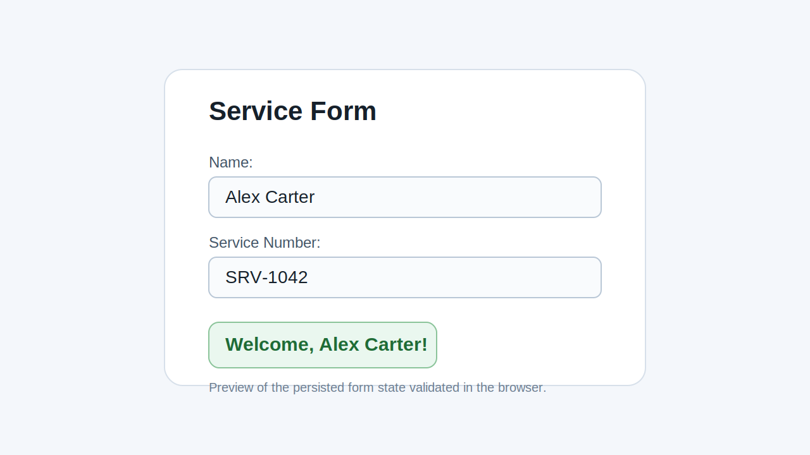

# Form Storage Lab

## Overview
This lab adds a reusable `useLocalStorage` custom hook to a React service form so the user's input survives a page refresh. The `name` and `serviceNumber` fields are stored in browser local storage instead of a database.

## Features
- Persists the `name` field between refreshes.
- Persists the `serviceNumber` field between refreshes.
- Reuses the same `useLocalStorage` hook for both controlled inputs.
- Displays a welcome message based on the saved name.

## Preview


## Getting Started
1. Install dependencies:

```sh
npm install
```

2. Start the development server:

```sh
npm run dev
```

3. Run the test suite:

```sh
npm run test
```

## Implementation Notes
- `useLocalStorage(key, initialValue)` reads the initial value from `localStorage` and falls back to the provided default.
- A `useEffect` keeps local storage synchronized whenever the field state changes.
- The form uses the hook with the required keys `name` and `serviceNumber`.

## Project Structure
- `src/hooks/useLocalStorage.js`: reusable persistence hook.
- `src/components/Form.jsx`: service form wired to local storage-backed state.

## Resources
- [React Docs: Reusing Logic with Custom Hooks](https://react.dev/learn/reusing-logic-with-custom-hooks)
- [MDN: Window.localStorage](https://developer.mozilla.org/en-US/docs/Web/API/Window/localStorage)